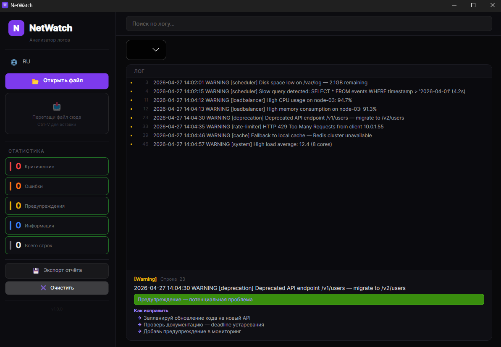
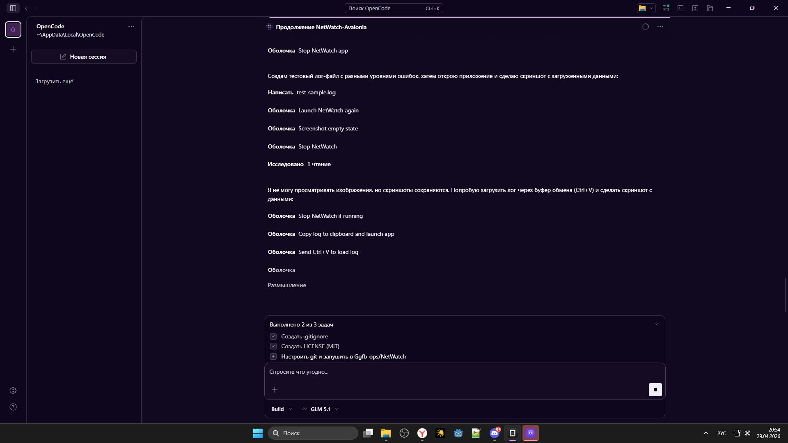

# NetWatch

**Drop a log file — get instant diagnosis.**

NetWatch is a desktop log analyzer that detects errors, groups them into issues, explains what went wrong, and tells you how to fix it.




## What it does

You're staring at a 10,000-line log file at 2 AM. Something broke. What now?

NetWatch turns that wall of text into structured insight:

- **Auto-detects error levels** — Critical, Error, Warning, Info — across 80+ patterns in English and Russian
- **Groups related errors** — consecutive failures + stack traces become a single actionable issue
- **Explains every issue** — "ECONNREFUSED" becomes "Network error: remote host refused connection"
- **Suggests fixes** — each explanation comes with concrete steps to resolve the problem
- **Exports HTML reports** — styled, self-contained, ready to share with the team

## Supported log formats

| Format | Detection |
|--------|-----------|
| Plain text (app logs) | Keyword patterns |
| Syslog | PRI/timestamp parsing |
| Nginx access log | Combined format |
| Windows Event XML | Structured event extraction |

## How to use

1. **Download** the latest release from [Releases](https://github.com/Ggfb-ops/NetWatch-Avalonia/releases)
2. **Unzip** and run `NetWatch.exe`
3. **Drag & drop** a `.log`, `.txt`, or `.json` file — or **Ctrl+V** to paste from clipboard
4. Browse issues, search, filter, and export reports

No .NET runtime needed — it's a self-contained single executable.

## Features

- Full-text search with level filtering
- RU / EN interface toggle
- Dark theme UI
- Cross-platform (Windows, macOS, Linux)

## Build from source

```bash
dotnet build NetWatch.csproj -c Release
dotnet test NetWatch.Tests/
```

## Tech

Avalonia 12 · .NET 9 · CommunityToolkit.Mvvm · 38 xUnit tests

## License

MIT
